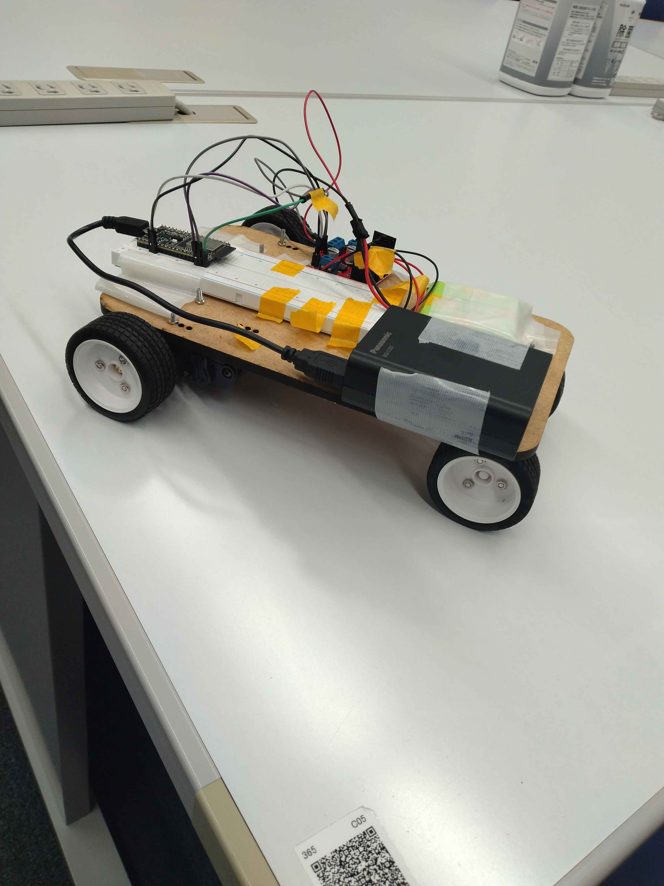
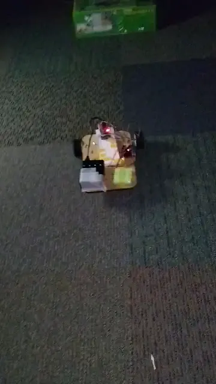
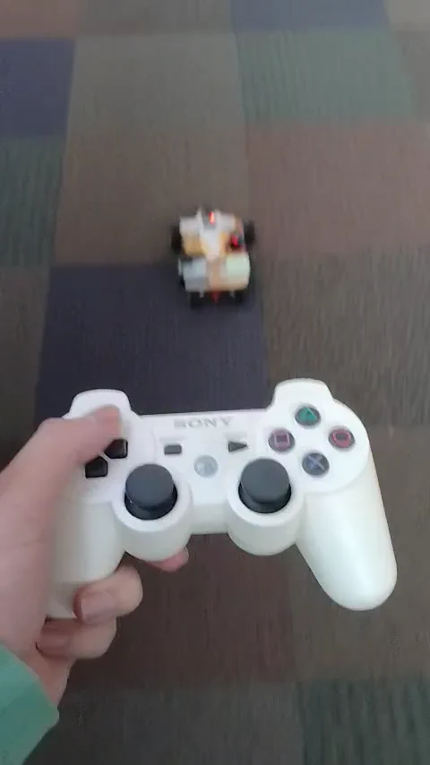

こんにちは、sugimotoです。

この春休みに、ハードウェアサークルの余り部品と約1000円の追加購入だけで、簡易ロボットカーを作ってみました。
この記事では、その制作過程や詰まった点、実際に動くようになるまでの流れを書いていきます。

まずは完成したロボットカーの写真です。

## 1. ことの発端

もともとロボット制作には興味があったのですが、なかなか手を付けられずにいました。  
ただ、来年度はハードウェアサークルの部長を務めることになったので、「まずは簡単なロボットくらいは自分で作っておいた方がいいだろう」と思い、春休みを使って制作してみることにしました。

## 2. 材料

基本的には、ハードウェアサークルの余りもの部品を使いました。  
追加で購入したのは、モーターを制御するために必要なモータードライバーのみで、費用は約1000円です。

### 部品リスト

- ESP32 DevKitC × 1
- L298N モータードライバー × 1（自費購入）
- タミヤのギアドモーター × 2
- タイヤ × 4
- 部室にあった加工途中の板 × 1
- ネジ類
- PS3コントローラー × 1
- ブレッドボード × 1
- 5V電源 × 2

ここで少しサークルの宣伝をすると、ハードウェアサークルの部室には、ESP32 や Arduino、Raspberry Pi Pico などのマイコンをはじめ、モーターや電子部品、各種工具が揃っています。  
「ちょっと試してみたい」と思ったときに、すぐ手を動かせる環境があるのはかなり大きいです。

もちろん、はんだごてもあります。

## 3. 制作過程

### 1日目

Arduino Uno R3 を使って、まずはモーターを1つ動かすところから始めました。

### 2日目

2つ目のモーターも動かそうとして試行錯誤していました。  
最初に使っていたのは L298D というモータードライバだったのですが、電圧降下が大きかったのか、あるいは流せる電流が足りなかったのか、モーターを2個同時に動かすことができませんでした。

この問題でかなり詰まり、しばらく大きな進展がありませんでした。

### 5日目

L298N というモータードライバーを Amazon で購入しました。  
結果的には、2個のモーターを動かすにはこれが一番の近道でした。

### 6日目

モータードライバーが届き、ここで一気に進みました。  
2個のモーターを動かし、左右を制御できるところまで到達しました。

### 7日目

マイコンを ESP32 に切り替えました。  
理由は、標準で Bluetooth 通信が使えるからです。

この時点で車体もひとまず完成し、前進・後進・左右旋回といった基本動作を実装しました。

### 8日目

Bluetooth 通信で PC と ESP32 を接続し、コマンド操作でロボットカーを前進・後進・左右旋回できるようにしました。

また、カーペットの上ではキャスターボールの摩擦が大きかったため、後輪をキャスターボールから2輪のタイヤに変更しました。

### 9日目

PS3 のコントローラーでロボットカーを操縦できるようにしました。  
想像していたよりも簡単に実装できて、かなり面白かったです。

## 4. 制作してみての感想

思っていたよりもスムーズに制作を進められた、というのが率直な感想です。  
そして何より、普通に楽しかったです。

もちろん、これはハードウェアサークルの環境があったからこそできた部分も大きいです。  
必要な部品や工具が近くにあるだけで、試行錯誤のハードルはかなり下がると感じました。

今回の制作を通して、はんだ付けや回路に関する初歩的な知識は確実に身についたと思います。  
特に、はんだ付けへの抵抗感がなくなったのは、自分の中でかなり大きな変化でした。

また、実際にロボットカーを作ってみて、改めて「ものづくりは楽しい」と感じました。  
どうやってパーツを取り付けるか、どうすればうまく動かせるかを考えながら手を動かす時間はかなり面白かったです。

## 5. 最後に：今後の展望

今回作ったロボットカーは、サークルの勧誘会でハードウェアサークルのブースにて実演する予定です。  
未来大生の方で興味がある人は、ぜひ見に来てください。

間に合えば、サークルのパンフレットを発射する簡単な射出装置もこのロボットカーに搭載する予定です。  
そこまでいけたら、もう少し“勧誘マシン”っぽくなるはずです。

## 6. 最後に宣伝

ハードウェアサークルには、マイコンや電子部品、工具が揃っていて、思いついたものをすぐ試せる環境があります。  
未経験でも、実際に手を動かしながら学べるのが大きな魅力です。

「ロボットや電子工作に少し興味がある」
「マイコンを触ってみたい」
「何か作ってみたい」

そんな人にはかなり向いていると思います。

しかも、入部初年度は部費無料です。
2年目からは1000円かかりますが、最初の1年は気軽に入って試せます。

つまりお得です

興味のある未来大生は、ぜひ勧誘会で見に来てください。
